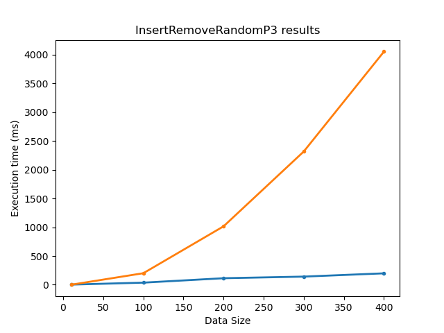
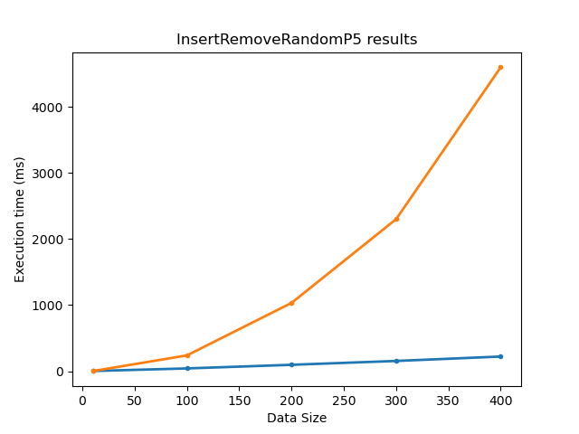

# JVM - Priority Queue with $O(logn)$ removals

csd4366 - Orfeas Chatzipanagiotis <br>
csd4149 - Konstantinos Anemozalis <br>

## Introduction

The priority queue is one of the most commonly used data structures in applications.
Most modern languages have support for the priority queue data structure through their
standard libraries. Java provides a priority queue class with a standard implementation
that offers low space complexity as well as $O(1)$ access to the first element of the
priority queue. However, one operation that is often very slow on priority queues is
element deletion. Deletion has a $O(n)$ time complexity making it extremely inefficient
for applications that delete elements very frequently. We introduced a new priority queue
implementation that is optimized for fast deletions using a hash map. The hash table is
used along side the heap structure to maintain the indices of all the elements in the
heap and support arbitrary element removals in $O(logn)$.

## Standard implementation

The priority queue implementation in the Java standard library uses a heap structure, a
one-dimensional array with size equal or greater to the number of elements in the priority
queue. It also caches the first element to ensure $O(1)$ access.

## Our implementation

Our implementation sacrifices $O(n)$ extra space to support $O(logn)$ removal time. This is
achieved using a hash table that keeps track of all the indices a certain element is present
on (it can be multiple). The picture below better envisions this concept:


## Time complexity comparison

|                 | Insert          | Poll            | Peek            | Remove          |
|---------------- | --------------- | --------------- | --------------- | --------------- |
| Original impl.  | $O(logn)$       | $O(logn)$       | $O(1)$          | $O(n)$          |
| Our impl.       | $O(logn)$       | $O(logn)$       | $O(1)$          | $O(logn)$       |

## Limitations & Drawbacks

Despite improving the overall complexity of the removal times, our implementation has two 
main drawbacks:

1) It suffers from a high constant factor since it has to perform a lot of bookkeeping.
Depending on the application the constant factor may become significant enough that our
implementation performs worse than the original

2) It has a much larger memory footprint in order to store the hash map

## Benchmarking

We exhibited a series of benchmarks based on various test cases that we created. The test
cases were created at random and contained different patterns in order to observe how our
algorithm performs. Here is a picture that shows our benchmarking pipeline:


The data generator was a simple script that produced a list of instructions in the form of:

```
...
INSERT 5
DELETE 1
INSERT 2
POLL   2
...
```

This list was then read by the instruction executor, the program we were experimenting on,
and it performed these operations on a priority queue. The test suites were produced once
in the beginning and then were tested on both our and original implementation.

### Turning off garbage collection

Since our goal was to compare the time differences between the two implementations, we set the
garbage collection threshold to a a very large number. Thus we avoided any collections would
skew our results.

## Generators

* ReverseRemoval - _original worst case scenario/our best case scenario_
  * This generator produces output that is the worst case scenario for the original implementation of the priority queue, and it is expected to run much faster in our implementation.
* Insert4Remove1
  * This generator inserts 4 elements, and removes 1 random that is already inside the priority queue.
* InsertRemoveRandom
  * This generator takes an integer parameter $p>=1$
    * It produces remove operations with probability $P = 1/p$
    * It produces remove operations with probability $P = 1 - 1/p$
    * We run this generator with two different p values:
      * $p = 3$ - One remove operation per 3 operations
      * $p = 5$ - One remove operation per 5 operations (should be similar to the Insert4Remove1)
* Insert4Poll1 - _original best case scenario/our worst case scenario (doesn't use remove operations)_

## Results

#### Blue line: our implementation
#### Orange line: standard JVM implementation

### Insert4Poll1


### Insert4Remove1


### InsertRemoveRandomP3



### InsertRemoveRandomP5



